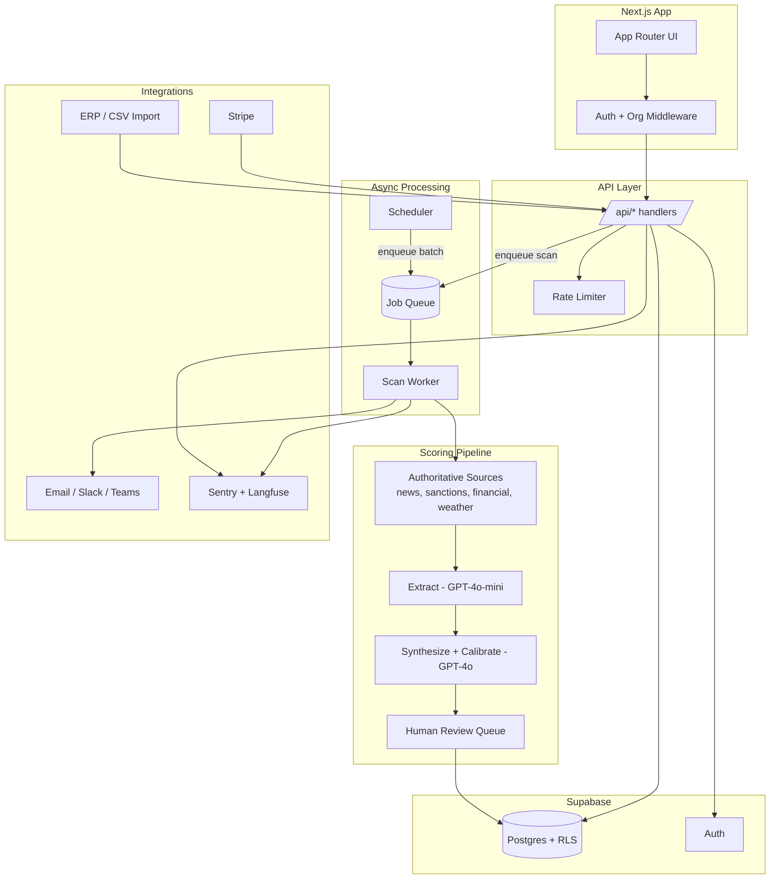

# SupplyPulse — Real-World Build Plan

> A phased plan to evolve SupplyPulse from a polished MVP into a production-grade,
> multi-tenant supplier risk intelligence platform that real procurement teams can
> trust and pay for.
>
> This document is written through three lenses, kept deliberately distinct:
> - **🏛 System Architect** — what the system must become structurally.
> - **👤 End User** — what a real procurement/ops user needs to adopt and stay.
> - **🛠 Software Engineer** — the concrete, file-level work to get there.

---

## 1. Where We Are Today (honest baseline)

SupplyPulse is a **unified Next.js 16 monolith** on Netlify, backed by Supabase
(Postgres + Auth + RLS) and Stripe, with an AI scoring agent implemented as
Netlify Functions. Roughly **85–90% of the MVP is built**: auth, supplier CRUD,
the 6-step ReAct scoring loop, trajectory charts, alerts, tiered billing, and a
daily cron all exist and largely work.

It is an **MVP, not a product a company would safely deploy yet.** The gap between
"demo that works for me" and "tool a stranger's procurement team trusts with real
supplier decisions" is what this plan closes.

### 1.1 Blocking issues for real-world use (must fix early)

These are not "nice to have" — they prevent real adoption:

| # | Issue | Evidence in code | Why it blocks real use |
|---|-------|------------------|------------------------|
| 1 | **Alerts go to ONE global inbox, not the supplier owner** | `sendAlert.js` sends to `process.env.ALERT_TO_EMAIL`; `buildAlertEmail` uses a single env recipient | In a real deployment with many users, *every* user's alerts would hit the operator's single inbox. This makes the product unusable beyond one person. |
| 2 | **`alert_log` schema mismatch** | `sendAlert.js` inserts `{ supplier_id, score_id, score, channels }`; the alerts UI expects `channel` + `sent_at` | Alerts history page renders empty/broken. |
| 3 | **No SQL migrations in the repo** | No `*.sql` files anywhere; schema only described in `supplypulse_build_plan.md` | Nobody can reproducibly stand up the DB; schema drift is guaranteed. |
| 4 | **No automated tests, no CI/CD** | No test files, no workflow config | Every change risks silent regressions in scoring/billing. |
| 5 | **Synchronous scoring blocks the request** | `score-supplier.js` runs the full agent loop inline | Long scans hit serverless timeouts; bulk scans don't scale. |
| 6 | **Marketed features not implemented** | `plans.ts` advertises Enterprise "every 6 hours"; `scheduled-scan.js` treats Pro/Enterprise identically (daily). 10-point-drop alert rule advertised but `sendAlert.js` only checks `score < threshold` | Promising what you don't deliver = churn + trust loss. |
| 7 | **API URL inconsistency** | Some components hardcode `/.netlify/functions/*` instead of `apiUrl()` from `src/lib/api.ts` | Breaks if API is ever moved/proxied; fragile. |

### 1.2 Trust & data-quality gaps (the real product risk)

The single biggest determinant of whether this product survives contact with real
users is **score accuracy and explainability**. Today:

- Search is **generic web search** (Tavily/Serper) over 5 keyword queries — noisy,
  easily polluted, no authoritative financial/legal/sanctions sources.
- Scores are a single GPT-4o judgment with **no calibration, no confidence surfaced
  to the user, no "why did this change" diffing**, and **no human review path**.
- There is **no source-of-truth audit trail** a procurement manager could show their
  boss to justify dropping a supplier.

A wrong score that causes a real business decision is an existential risk. The plan
treats **trust engineering** as a first-class workstream, not a feature.

---

## 2. Guiding Principles (the three lenses)

### 🏛 System Architect
1. **Multi-tenant by default.** Every row, query, and alert is scoped to an
   organization, not a single global user.
2. **Async-first.** Scoring is a queued background job, not an HTTP request.
3. **Reproducible infrastructure.** Versioned migrations, infra-as-config, one-command
   environment bring-up.
4. **Observable.** Every scan, alert, and LLM call is traced, logged, and costed.
5. **Defense in depth.** RLS + server-side authz + rate limiting + secret hygiene.

### 👤 End User
1. **Trust over magic.** Always show *why* — sources, confidence, what changed.
2. **Zero-to-value in <10 minutes.** Bulk import, sensible defaults, guided onboarding.
3. **Fits existing workflow.** Slack/Teams/email digests, CSV/ERP import, exportable
   briefs they can forward to leadership.
4. **No surprises.** Honest alerting (no false-alarm fatigue), clear disclaimers.
5. **Team-shaped.** Multiple users per company, shared watchlists, roles.

### 🛠 Software Engineer
1. **Tested before shipped.** Critical paths (scoring, billing, authz) have automated tests.
2. **Typed end-to-end.** DB types generated from schema; no `any` at boundaries.
3. **Small, reviewable changes** behind feature flags where risky.
4. **Idempotent + retry-safe** jobs and webhooks.
5. **Migrations, not manual SQL** in the Supabase dashboard.

---

## 3. Target Architecture



**Key structural shifts from today:**
- Introduce an **organization (tenant) layer** above users.
- Replace **synchronous scoring** with a **queue + worker** (Netlify background
  functions or a dedicated queue like Supabase `pg_cron` + a queue table, or QStash/Inngest).
- Add an **authoritative data source layer** and a **human review queue**.
- Add **observability** (Sentry for errors, Langfuse for LLM traces) and
  **rate limiting** at the edge.

---

## 4. Data Model Evolution

Current core tables: `suppliers`, `supplier_scores`, `supplier_signals`,
`alert_log`, `user_subscriptions`, `user_profiles`.

Target additions / changes:

```text
organizations
  id, name, created_at, billing_status, tier
organization_members
  org_id, user_id, role (owner|admin|analyst|viewer), created_at
suppliers
  + org_id (FK)  ← scope to org instead of single user_id
  + tags text[], internal_owner, contract_value, region
alert_recipients              ← replaces global ALERT_TO_EMAIL
  id, org_id, supplier_id (nullable = org-wide), channel (email|slack|teams),
  destination, enabled
alert_log                     ← fix schema to match UI + add org scope
  id, org_id, supplier_id, score_id, score, channels text[], sent_at, status
scan_jobs                     ← async queue state
  id, org_id, supplier_id, status (queued|running|done|failed), attempts,
  scheduled_for, started_at, finished_at, error, cost_usd
score_reviews                 ← human-in-the-loop
  id, score_id, reviewer_id, action (confirmed|overridden), override_score, note
supplier_scores
  + confidence numeric, + model_version, + source_count, + prev_score (for diffing)
supplier_signals
  + source_tier (authoritative|news|web), + published_at
audit_log                     ← compliance
  id, org_id, actor_id, action, target, metadata jsonb, created_at
usage_counters                ← cost control / metering
  org_id, period, scans_used, llm_tokens, est_cost_usd
```

All new tables get **RLS policies** scoping reads/writes to `org_id` via
`organization_members`. Migrations are versioned (see §5, Phase 0).

---

## 5. Phased Roadmap

Each phase ends with a **Definition of Done** and is independently shippable.
Estimates assume one focused engineer; parallelize where noted.

---

### Phase 0 — Foundation Hardening *(1–2 weeks)*
**Goal:** Make the existing MVP reproducible, tested, and free of the blocking bugs.
Do this before building anything new.

🏛 Architect
- Adopt **Supabase CLI migrations**. Capture current live schema into
  `supabase/migrations/0001_init.sql` as the baseline.
- Stand up **CI** (GitHub Actions): lint, typecheck, build, run tests on every PR.

🛠 Engineer — concrete tasks
1. **Migrations baseline**
   - `npx supabase init`; dump current schema → `supabase/migrations/0001_baseline.sql`.
   - Add `supabase/seed.sql` for local dev fixtures.
   - Document `supabase db reset` flow in README.
2. **Fix `alert_log` schema mismatch** (Issue #2)
   - Decide canonical columns: `{ id, supplier_id, score_id, score, channels text[], sent_at }`.
   - Migration to add `sent_at default now()`; update alerts UI
     (`src/app/(app)/alerts/`) to read `channels` + `sent_at`.
3. **Fix API URL inconsistency** (Issue #7)
   - Route every client call through `apiUrl()` in `src/lib/api.ts`.
   - Grep for `/.netlify/functions/` in `src/` and replace in `SupplierForm`,
     `DangerZone`, `PlanSection`.
4. **Align marketed vs. real behavior** (Issue #6)
   - Either implement Enterprise 6-hour cadence in `scheduled-scan.js` OR change
     `plans.ts` copy to match reality. Pick one and make them consistent.
   - Implement the documented **10-point-drop** rule in `sendAlert.js` (compare to
     previous score) OR remove the claim from marketing copy.
5. **Test harness**
   - Add Vitest + a thin integration runner. First tests:
     - `synthesizeScore` returns valid Zod-validated shape on fixture input.
     - `suppliers.js` enforces tier limits.
     - Stripe webhook updates subscription tier (mocked).
6. **Error tracking**
   - Wire **Sentry** into the Next app and functions (DSN via env).

**Definition of Done:** Fresh clone → `supabase db reset` + env → working app; CI
green; alerts page renders real data; no hardcoded function paths; marketing claims
match behavior.

---

### Phase 1 — Multi-Tenancy & Teams *(2–3 weeks)*
**Goal:** Turn a single-user tool into a multi-user, multi-company product.
**This is the highest-leverage change for real-world use.**

🏛 Architect
- Introduce `organizations` + `organization_members`; every supplier, score, alert,
  and job is scoped to an org.
- Billing moves from per-user to **per-organization** (Stripe customer = org).

👤 End User
- Invite teammates by email with roles (owner/admin/analyst/viewer).
- Shared supplier watchlist across the team.
- Per-user notification preferences.

🛠 Engineer
1. Migration: create `organizations`, `organization_members`; backfill — create one
   org per existing user, set them `owner`, add `org_id` to `suppliers` etc.
2. RLS: rewrite policies to scope by `org_id` via membership lookup.
3. Middleware (`middleware.ts` / `proxy.ts`): resolve active org from session; add
   `/profile` to protected routes (currently missing in `middleware.ts`).
4. Org-aware data access: thread `org_id` through `suppliers.js`, scoring, alerts.
5. **Replace global `ALERT_TO_EMAIL`** (Issue #1) with `alert_recipients` table;
   `sendAlert.js` resolves recipients per supplier's org.
6. Invite flow UI + `invite-member` / `accept-invite` functions.
7. Move Stripe customer/subscription to org level; migrate `user_subscriptions` →
   `organization` billing fields.

**Definition of Done:** Two separate companies can sign up, never see each other's
data, invite teammates, and each receive only their own alerts.

---

### Phase 2 — Trust & Data Quality *(3–4 weeks, the product moat)*
**Goal:** Make scores accurate, explainable, and defensible. Without this, nothing
else matters.

🏛 Architect
- Add an **authoritative source layer** above generic web search:
  - **Sanctions/watchlists:** OFAC SDN, EU/UN consolidated lists (free).
  - **Legal/regulatory:** court/regulator feeds where available.
  - **Financial distress signals:** company filings / credit-style signals
    (start with free/low-cost sources; design adapter interface for paid data
    like D&B/Creditsafe later).
  - **Geopolitical/disruption:** news APIs with source ranking; optional weather/
    natural-disaster feeds for region risk.
- Define a **source tiering** model (`authoritative > reputable news > open web`)
  and weight signals accordingly.

👤 End User
- Every score shows **confidence** and **"what changed since last scan"** (diff of
  score + new/resolved signals).
- Every signal links to its **source with publish date**; users can dismiss/flag a
  signal as irrelevant (feedback loop).
- A **"Risk brief"** view that's screenshot/PDF-exportable for leadership.

🛠 Engineer
1. Refactor `webSearch.js` into a **source adapter interface**; add adapters:
   `sanctionsSearch`, `newsSearch`, `filingsSearch`, plus existing web fallback.
2. Extend `extractSignals.js` to tag `source_tier` and `published_at`.
3. Rework `synthesizeScore.js`:
   - Pass source tiers + recency; instruct model to weight authoritative > web.
   - Emit a calibrated `confidence` (0–1) and a structured rationale.
   - Compute `prev_score` diff and surface it.
4. Add **golden-set evaluation**: a fixtures set of known-good/known-bad suppliers;
   measure score stability and direction correctness across model/prompt changes.
   Track in CI to prevent prompt regressions.
5. Signal feedback: `signal_feedback` table + UI to flag irrelevant signals; feed
   back into prompt context on next scan.
6. PDF/print export of the risk brief.

**Definition of Done:** A user can open any score and answer "why this number, from
what sources, and what changed" without leaving the page; prompt changes are gated
by an eval suite.

---

### Phase 3 — Reliability & Scale *(2–3 weeks)*
**Goal:** Scoring that doesn't time out, scales to thousands of suppliers, and
costs are controlled.

🏛 Architect
- Replace synchronous `score-supplier.js` with a **queue + worker** (Issue #5):
  - Option A (lean): Netlify **background functions** + a `scan_jobs` table.
  - Option B (robust): a managed queue (Inngest/QStash) triggering a worker.
- `scheduled-scan.js` enqueues jobs instead of fan-out fetch; worker drains the queue
  with concurrency + retry + backoff.

👤 End User
- "Scan" returns instantly; UI shows queued → running → done with live status
  (extend `useScanPolling.ts` to read `scan_jobs`).

🛠 Engineer
1. `scan_jobs` table + enqueue/claim/complete functions (atomic claim via
   `update ... returning` or `select ... for update skip locked`).
2. Worker: process job → run `runAgentLoop` → write status, cost, error.
3. Retry policy (max attempts, exponential backoff); dead-letter on repeated failure.
4. **Cost metering:** record per-scan token usage + estimated USD into
   `usage_counters`; enforce per-org monthly scan quotas by tier.
5. **LLM observability:** wire **Langfuse** traces around extract/synthesize calls.
6. Caching: skip re-search when no new sources since last scan (cheap pre-check).

**Definition of Done:** 500-supplier batch completes reliably without timeouts;
each scan's cost is recorded; quotas enforced; failed jobs retried and visible.

---

### Phase 4 — Security & Compliance *(2–3 weeks)*
**Goal:** Pass the security questionnaire a mid-market buyer will send you.

🏛 Architect
- **RLS audit:** prove every table denies cross-org access (automated test).
- **Rate limiting** at the edge (per-IP + per-org) on all `/api/*`.
- **Secret hygiene:** no secrets in client bundles; rotate keys; least-privilege
  service role usage.
- **Audit logging** of sensitive actions (member changes, deletions, plan changes).

👤 End User
- Clear data-handling + disclaimer copy ("indicators only, not advice").
- Self-serve **data export** and **account/org deletion** (extend `delete-account.js`
  to full org-level GDPR delete).

🛠 Engineer
1. RLS test suite: as user A, attempt to read/write org B's rows → expect denial.
2. Rate limiter middleware (Upstash Redis or Supabase-based token bucket).
3. `audit_log` writes on all privileged mutations.
4. Security headers (CSP, HSTS) via `next.config.ts` / Netlify headers.
5. Dependency scanning (Dependabot) + secret scanning in CI.
6. Begin **SOC 2 readiness** checklist (policies, access reviews, vendor list) —
   document, even if certification comes later.

**Definition of Done:** Automated proof of tenant isolation; rate limiting live;
audit trail for sensitive actions; documented security posture you can hand a buyer.

---

### Phase 5 — Workflow Integrations *(2–3 weeks)*
**Goal:** Fit into how procurement teams already work so adoption sticks.

👤 End User
- **Bulk CSV import** of suppliers (map columns, dedupe, validate).
- **Microsoft Teams** alerts (many procurement teams aren't on Slack).
- **Weekly digest email** summarizing portfolio risk + biggest movers.
- **Public read API + API keys** for teams that want to pull scores into BI/ERP.

🛠 Engineer
1. CSV import: client wizard + `import-suppliers` function with validation + tier
   limit checks + async enqueue of initial scans.
2. Teams webhook channel in `alert_recipients` + `sendAlert.js`.
3. Digest: scheduled function builds per-org summary; respects recipient prefs.
4. API keys table + `/api/v1/*` namespace with key auth + rate limits + docs.
5. (Stretch) ERP adapter interface (start with a generic webhook/CSV bridge).

**Definition of Done:** A user can import 100 suppliers from CSV in one flow, get a
weekly digest, and pull scores via an API key.

---

### Phase 6 — Product Depth & Differentiation *(ongoing)*
**Goal:** Reasons to pay more and stay.

👤 End User
- **Alternative supplier suggestions** when one goes high-risk.
- **Portfolio dashboard:** concentration risk by region/category, trend over time.
- **Custom scoring weights** per org (e.g., weight financial > geopolitical).
- **Scheduled executive reports** (PDF) auto-emailed monthly.
- **Scenario alerts:** "notify if any supplier in region X drops."

🛠 Engineer
- Build incrementally based on **real user feedback from Phases 1–5**, not speculation.

---

### Phase 7 — Go-to-Market Readiness *(parallel with 4–6)*
**Goal:** Be ready to charge and support customers.

👤 End User / Business
- Pricing revisited (current $19.99 Pro likely below cost for heavy users — see §7).
- Onboarding flow + sample data + product tour.
- Status page, support inbox, basic SLAs.
- Legal: ToS, privacy policy, DPA template, disclaimer prominence.
- 5–10 design-partner companies using it free for case studies.

---

## 6. Cross-Cutting Workstreams

| Workstream | Spans | Key deliverables |
|------------|-------|------------------|
| **Testing** | All phases | Vitest unit + integration; scoring eval set; RLS isolation tests; E2E (Playwright) for signup→scan→alert. |
| **Observability** | Phase 0+ | Sentry (errors), Langfuse (LLM), structured logs already in `logger.js` → ship to a log sink. |
| **Migrations** | Phase 0+ | Every schema change is a versioned migration; no dashboard edits. |
| **Docs** | All | Keep README + this plan current; add runbook for incidents and a data-source registry. |
| **Cost control** | Phase 3+ | Token metering, per-tier quotas, alerting on cost spikes. |

---

## 7. Unit Economics & Cost Reality (must-solve)

Every scan costs real money (OpenAI + search APIs). A Pro user with 25 suppliers
scanned daily ≈ **750 scans/month**, which can cost **more than the $19.99 price**
for heavy users.

Actions baked into the plan:
- **Meter every scan** (Phase 3 `usage_counters`).
- **Enforce per-tier scan quotas**, not just supplier counts.
- **Reduce cost per scan:** skip-if-no-new-sources caching, cheaper extraction model,
  batch where possible.
- **Revisit pricing:** model gross margin per tier *before* public launch; likely
  raise Pro and add usage-based overage for high-volume orgs.

> Decision needed from you: target gross margin per tier. The plan's quota and
> caching design depends on this number.

---

## 8. Risk Register

| Risk | Impact | Mitigation (phase) |
|------|--------|--------------------|
| Inaccurate scores erode trust | Existential | Authoritative sources + confidence + human review + eval set (P2) |
| API costs exceed revenue | High | Metering, quotas, caching, pricing revisit (P3, P7) |
| Cross-tenant data leak | Existential | RLS + isolation tests + audit (P1, P4) |
| Serverless timeouts on scans | High | Queue + worker (P3) |
| Competing with funded incumbents | Medium | Price + niche focus + speed (P7) |
| Solo-maintainer bus factor | Medium | Tests, CI, docs, runbooks (all phases) |
| Legal exposure from a bad call | Medium | Prominent "indicators only" disclaimers + audit trail (P2, P4) |

---

## 9. Suggested Execution Order (TL;DR)

1. **Phase 0** — stop the bleeding: migrations, fix blocking bugs, tests, CI. *(do first)*
2. **Phase 1** — multi-tenancy & teams. *(unlocks real adoption)*
3. **Phase 2** — trust & data quality. *(the moat)*
4. **Phase 3** — reliability & scale. *(don't fall over)*
5. **Phase 4** — security & compliance. *(unlock mid-market deals)*
6. **Phase 5** — integrations. *(adoption stickiness)*
7. **Phases 6–7** — depth + GTM, driven by real users.

Ship each phase behind feature flags, dogfood with design partners after Phase 2,
and let real feedback reorder Phases 5–6.

---

## 10. Immediate Next Actions (this week)

- [ ] `supabase init` + capture baseline migration from the live schema.
- [ ] Fix `alert_log` schema + alerts UI (Issue #2).
- [ ] Route all client calls through `apiUrl()` (Issue #7).
- [ ] Make `plans.ts` claims match `scheduled-scan.js` / `sendAlert.js` (Issue #6).
- [ ] Add Vitest + first 3 tests (scoring shape, tier limits, webhook).
- [ ] Add GitHub Actions CI (lint + typecheck + build + test).
- [ ] Decide target gross margin per tier (drives Phase 3 design).

---

*This plan is intentionally phased and reversible. Build the foundation, earn trust
with accurate scores, then scale — in that order.*
